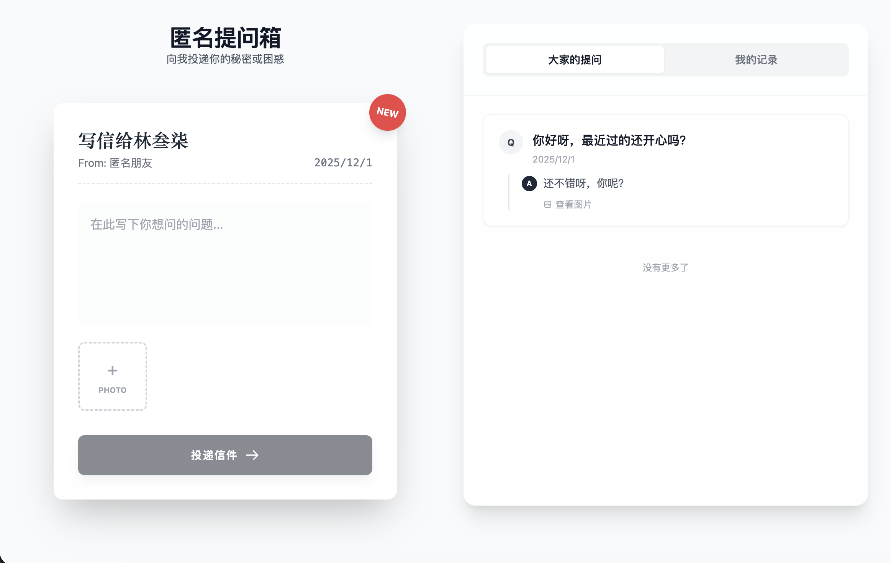
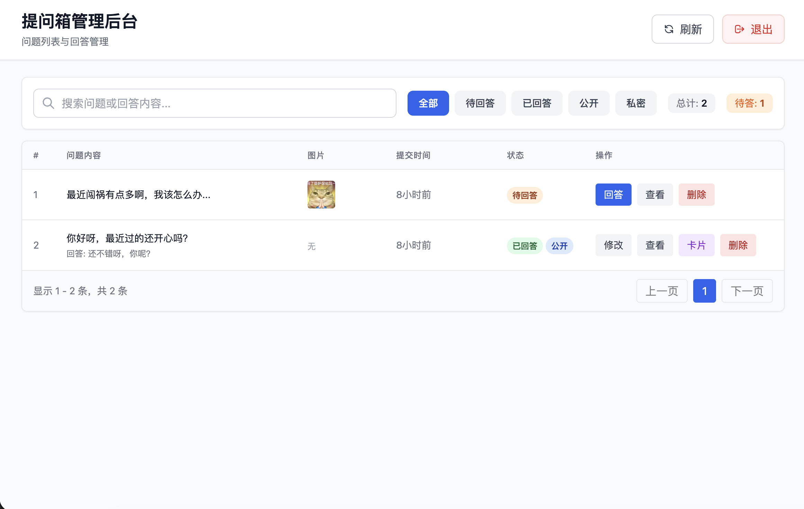

# 🎯 QA Box - 匿名提问箱

<div align="center">

一个精美的匿名提问箱 Web 应用，让互动更有趣。

[](https://opensource.org/licenses/MIT)
[](https://www.python.org/downloads/)
[](https://vuejs.org/)

[在线演示](#) | [快速开始](#-快速开始) | [部署教程](DEPLOY.md) | [English](README_EN.md)

</div>

---

## 📸 预览

<div align="center">

### 前台提问界面


### 管理后台


### 分享卡片


</div>

## ✨ 核心特性

### 🎨 用户体验
- **精美动画** - 信箱投递动画效果，让提问更有仪式感
- **响应式设计** - 完美适配桌面端和移动端
- **实时反馈** - 问题状态实时更新，支持撤回功能
- **分享卡片** - 一键生成精美的问答分享卡片

### 📷 图片功能
- **图片上传** - 支持问题和回答中上传图片（最多9张）
- **智能限制** - 前端：10MB/张，50MB/次；管理员无限制
- **按周存储** - 自动按周分文件夹管理上传文件
- **图片压缩** - 导出卡片时自动压缩，加快生成速度

### 🔒 安全机制
- **JWT 认证** - 提问者可凭 Token 撤回未回答的问题
- **管理后台** - 密码保护 + Token 自动续期
- **隐藏路由** - 管理后台路径可自定义，默认 `/console-x7k9m`
- **后端验证** - 图片大小双重验证（前端+后端）

### 💾 数据管理
- **自动备份** - SQLite 数据库定时自动备份
- **备份清理** - 自动清理旧备份，保留最近 7 个
- **零配置** - 使用 SQLite，无需额外数据库服务

## 🚀 快速开始

### 一键部署（推荐）

```bash
# 1. 克隆项目
git clone https://github.com/yourusername/qa_box.git
cd qa_box

# 2. 配置环境变量
cp backend/.env.example backend/.env
cp frontend/.env.example frontend/.env
# 编辑 backend/.env 和 frontend/.env，修改必要配置（SECRET_KEY、ADMIN_PASSWORD等）

# 3. 启动服务
chmod +x deploy.sh
./deploy.sh start
```

服务启动后访问：
- 📱 **前台页面**: http://localhost:13000
- 🔐 **管理后台**: http://localhost:13000/console-x7k9m
- 📖 **API 文档**: http://localhost:18000/docs

### 其他部署命令

```bash
./deploy.sh stop      # 停止所有服务
./deploy.sh restart   # 重启所有服务
./deploy.sh status    # 查看服务状态
./deploy.sh logs      # 查看日志
./deploy.sh build     # 仅重新构建前端
```

### 开发环境

<details>
<summary>点击展开开发环境配置</summary>

**后端开发**
```bash
cd backend
python3 -m venv .venv
source .venv/bin/activate  # Windows: .venv\Scripts\activate
pip install -r requirements.txt
uvicorn backend.main:app --reload --host 0.0.0.0 --port 8000
```

**前端开发**
```bash
cd frontend
pnpm install  # 或 npm install
pnpm dev      # 或 npm run dev
```

</details>

## 📦 技术栈

### 后端
- **FastAPI** - 现代高性能 Python Web 框架
- **SQLAlchemy 2.0** - 强大的 ORM 框架
- **SQLite** - 轻量级嵌入式数据库（aiosqlite 异步驱动）
- **JWT** - 身份认证和撤回机制
- **Gunicorn + Uvicorn** - 生产级 ASGI 服务器

### 前端
- **Vue 3** - 渐进式 JavaScript 框架（Composition API）
- **Vite** - 极速的前端构建工具
- **TailwindCSS** - 实用优先的 CSS 框架
- **Axios** - 基于 Promise 的 HTTP 客户端
- **Vue Router** - 官方路由管理器
- **html2canvas** - 卡片生成库

## 🔧 核心配置

### 后端环境变量 (`backend/.env`)

```bash
# ============================================
# 安全配置 (生产环境必须修改！)
# ============================================
SECRET_KEY=your-secret-key-please-change-in-production-min-32-chars
ADMIN_USERNAME=admin
ADMIN_PASSWORD=change-this-strong-password

# ============================================
# 管理后台配置
# ============================================
# 管理路由前缀（建议改为随机路径）
# 重要：需要与前端 VITE_ADMIN_ROUTE_PREFIX 保持一致
ADMIN_ROUTE_PREFIX=/console-x7k9m

ADMIN_TOKEN_EXPIRE_DAYS=7                   # Token 过期天数
ADMIN_TOKEN_REFRESH_DAYS=1                  # 剩余天数小于此值时自动续期

# ============================================
# 服务器配置
# ============================================
HOST=127.0.0.1                              # 监听地址
PORT=18000                                  # 后端端口
FRONTEND_PORT=13000                         # 前端端口
WORKERS=2                                   # Gunicorn worker 数量

# ============================================
# 备份配置
# ============================================
BACKUP_INTERVAL_HOURS=24                    # 自动备份间隔（小时），0 禁用
BACKUP_MAX_COUNT=7                          # 保留备份数量
```

### 前端环境变量 (`frontend/.env`)

```bash
# 后端服务地址（用于 Vite 代理）
VITE_BACKEND_HOST=127.0.0.1
VITE_BACKEND_PORT=18000

# 管理后台路由前缀 - 需要与后端 ADMIN_ROUTE_PREFIX 保持一致
# 重要：修改后需重新构建前端：pnpm build
VITE_ADMIN_ROUTE_PREFIX=/console-x7k9m
```

**⚠️ 重要说明：**
1. 后端的 `ADMIN_ROUTE_PREFIX` 和前端的 `VITE_ADMIN_ROUTE_PREFIX` **必须一致**
2. 修改管理路由前缀后：
   - 后端：重启服务 `./deploy.sh restart`
   - 前端：重新构建 `./deploy.sh build` 或 `cd frontend && pnpm build`
3. 为了安全，建议使用随机的、难以猜测的路径，如：`/admin-abc123xyz`

完整配置说明见 [`backend/.env.example`](backend/.env.example) 和 [`frontend/.env.example`](frontend/.env.example)

## 📚 详细文档

- 📖 [部署教程](DEPLOY.md) - 详细的生产环境部署指南
- 🔧 [后端 API 文档](http://localhost:18000/docs) - 启动服务后访问
- 🎨 [前端开发说明](frontend/README.md) - 前端项目结构和开发指南

## 🗂️ 项目结构

```
qa_box/
├── backend/                    # 后端服务
│   ├── main.py                # FastAPI 应用入口
│   ├── main_router.py         # 路由定义
│   ├── models.py              # 数据模型
│   ├── schemas.py             # Pydantic 数据验证
│   ├── config.py              # 配置管理
│   ├── auth.py                # 认证模块
│   ├── backup.py              # 自动备份模块
│   ├── upload_utils.py        # 文件上传工具
│   ├── .env.example           # 环境变量模板
│   └── requirements.txt       # Python 依赖
├── frontend/                   # 前端应用
│   ├── src/
│   │   ├── views/             # 页面组件
│   │   │   ├── AskPage.vue           # 提问页面
│   │   │   ├── AdminPage.vue         # 管理后台
│   │   │   └── AdminLogin.vue        # 登录页面
│   │   ├── api/               # API 封装
│   │   ├── utils/             # 工具函数
│   │   └── router/            # 路由配置
│   ├── package.json
│   └── vite.config.js
├── uploads/                    # 图片上传目录（按周分文件夹）
├── backups/                    # 数据库备份目录
├── screenshots/                # 项目截图
├── deploy.sh                   # 一键部署脚本
├── .gitignore                  # Git 忽略配置
├── README.md                   # 本文件
└── DEPLOY.md                   # 部署教程
```

## 🛡️ 安全建议

### 生产环境必做

1. ✅ **修改默认密码** - 更改 `ADMIN_PASSWORD`
2. ✅ **生成强密钥** - 使用 32+ 位随机字符串作为 `SECRET_KEY`
3. ✅ **自定义管理路径** - 修改 `ADMIN_ROUTE_PREFIX` 和 `VITE_ADMIN_ROUTE_PREFIX` 为不易猜测的路径
4. ✅ **配置 HTTPS** - 使用 Nginx + Let's Encrypt 证书
5. ✅ **限制访问 IP** - Nginx 配置白名单限制管理后台访问

### 可选加固

- 🔒 **双因素认证** - 为管理后台添加 2FA
- 🚫 **IP 黑名单** - 自动封禁暴力破解 IP
- 📊 **访问日志** - 记录和监控异常访问
- 🔐 **SSH 隧道** - 仅通过 SSH 访问管理后台

## 📊 性能优化

- **前端构建优化** - Vite 生产构建，代码分割和压缩
- **图片懒加载** - 大图片按需加载
- **数据库索引** - 关键字段建立索引
- **静态资源缓存** - Nginx 配置静态文件缓存
- **异步处理** - FastAPI 异步端点 + aiosqlite

## 🤝 贡献

欢迎提交 Issue 和 Pull Request！

## 📄 开源协议

[MIT License](LICENSE) - 自由使用，保留版权声明即可。

## 🙏 致谢

感谢所有开源项目的贡献者。

---

<div align="center">

**如果这个项目对你有帮助，请给个 ⭐️ Star 支持一下！**

Made with ❤️ by [Lin037]

</div>
